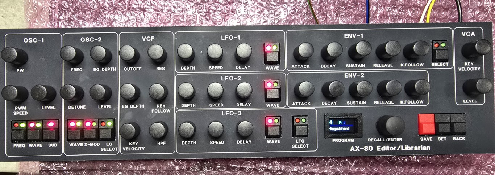

A second build of this midi controller for the AX-80, all 45 controls are presented with buttons and LEDs for the switch functions. Encoders for the 0-99 controls. Encoders give a more accurate edit of the current parameter and can be accelerated to transition quickly of slowly across the range.

It will have 999 patch memories and names and can be used as a master for the AX-80 which means you don't store any sounds on the AX and the editor is in charge. Or normal mode where it just edits parameters.

This version uses MCP23017 chips to read the encoders and buttons and also to drive the LED's. This reduces chip count, analogue mux jitter etc.

I added some shortcuts to the encoders for certain functions, so pusshing the detune encoder for instance turns off the detune handy instead of fiddling the knob to get to 50.

It also acts as a usb to MIDI converter so you can play the AX over USB from your DAW.

I've also mapped CC 7 for volume to CC 96 (VCA level) to act as a volume control.
